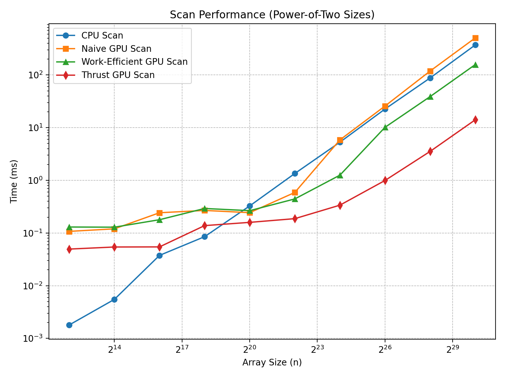

CUDA Stream Compaction
======================

**University of Pennsylvania, CIS 565: GPU Programming and Architecture, Project 2**

* Ruichi Zhang
  * [LinkedIn](https://www.linkedin.com/in/ruichi-zhang-537204381/)
* Tested on: Windows 10, AMD Ryzen 9 7950X3D @ 4201 Mhz, 16 Core(s), NVIDIA GeForce RTX 4080 SUPER

## 1. Project Description
This project implements **parallel prefix-sum (scan)** and **stream compaction** algorithms on both the CPU and GPU.  
The following features were implemented:

- **CPU Baseline**: a sequential prefix-sum for comparison.  
- **Naive GPU Scan**: a simple offset-based iterative implementation.  
- **Work-Efficient GPU Scan**: an implementation based on the up-sweep and down-sweep phases of the Blelloch algorithm.  
- **Thrust Scan**: a wrapper around Thrust’s `exclusive_scan`.  
- **Stream Compaction**: removes zero elements from arrays, implemented on both CPU and GPU.  

### Extra Credit Features
- **Optimized Work-Efficient GPU Scan**: in each iteration, the number of launched threads is halved compared to the previous level, reducing idle work and improving efficiency.

---

## 2. Performance Analysis

### Block Size Optimization
I experimented with different CUDA block sizes (32, 64, 128, 256, 512, 1024) for both **Naive** and **Work-Efficient** scans, using input size `n = 2^20`.  
On my GPU, the shortest average execution time for both implementations was achieved with a block size of **128**.  
Therefore, the block size for all subsequent experiments is set to **128**.

---

### Performance of CPU, Naive, Work-Efficient, and Thrust Scans

Figure 1 shows the performance of all implementations (Naive, Work-Efficient, Thrust, and CPU) for **power-of-two** array sizes (`2^n`). The performance trends for **non-power-of-two** inputs (`2^n - 3`) are qualitatively similar. 

<p align="center">
  
</p>

<p align="center"><em>Figure 1. Performance comparison of CPU, Naive, Work-Efficient, and Thrust scans (lower is better).</em></p>

<!--
<p align="center">
  
</p>
<p align="center"><em>Figure 2. Performance comparison for non-power-of-two sizes.</em></p>
-->

#### Observations
For small input sizes (< 2^20), the CPU baseline is faster due to the overhead associated with GPU parallelism. As the input size increases, GPU-based approaches outperform the CPU, benefiting from massive parallelism.  
Among GPU implementations, the Naive scan is slightly slower, partly due to the additional step of converting from inclusive to exclusive scan. The Work-Efficient scan is significantly faster, as the number of active threads is halved at each iteration, reducing redundant work. The Thrust implementation consistently achieves the best performance.

---

#### Analysis
Inspection of the Nsight timeline suggests that the superior performance of **Thrust Scan** arises from the use of warp-level intrinsics, coalesced memory access, and fewer kernel launches, which collectively minimize overhead.  

The performance bottlenecks differ across implementations:  
- **Naive Scan** is **computation-bound**, requiring many redundant additions and repeated kernel launches.  
- **Work-Efficient Scan** is **memory I/O-bound**; although it reduces computation to O(n), each up-sweep and down-sweep phase reads and writes the entire array, so global memory bandwidth becomes the limiting factor.  
- **Thrust Scan** is also bandwidth-limited, but highly optimized, approaching the GPU’s theoretical throughput.  
- **CPU Scan** is **computation-bound** due to sequential execution and the absence of parallelism.  

---

### Test Output
```
****************
** SCAN TESTS **
****************
    [   4  11  31   6  36  14  32  17   9  25  30  32  24 ...  13   0 ]
==== cpu scan, power-of-two ====
   elapsed time: 11.0901ms    (std::chrono Measured)
    [   0   4  15  46  52  88 102 134 151 160 185 215 247 ... 821691696 821691709 ]
==== cpu scan, non-power-of-two ====
   elapsed time: 11.5669ms    (std::chrono Measured)
    [   0   4  15  46  52  88 102 134 151 160 185 215 247 ... 821691661 821691661 ]
    passed
==== naive scan, power-of-two ====
   elapsed time: 12.449ms    (CUDA Measured)
    passed
==== naive scan, non-power-of-two ====
   elapsed time: 12.6491ms    (CUDA Measured)
    passed
==== work-efficient scan, power-of-two ====
   elapsed time: 5.11542ms    (CUDA Measured)
    passed
==== work-efficient scan, non-power-of-two ====
   elapsed time: 4.64278ms    (CUDA Measured)
    passed
==== thrust scan, power-of-two ====
   elapsed time: 0.574464ms    (CUDA Measured)
    passed
==== thrust scan, non-power-of-two ====
   elapsed time: 0.579616ms    (CUDA Measured)
    passed

*****************************
** STREAM COMPACTION TESTS **
*****************************
    [   1   3   0   1   3   1   2   0   3   1   0   0   1 ...   0   0 ]
==== cpu compact without scan, power-of-two ====
   elapsed time: 46.0976ms    (std::chrono Measured)
    [   1   3   1   3   1   2   3   1   1   1   2   2   3 ...   2   3 ]
    passed
==== cpu compact without scan, non-power-of-two ====
   elapsed time: 45.3187ms    (std::chrono Measured)
    [   1   3   1   3   1   2   3   1   1   1   2   2   3 ...   1   2 ]
    passed
==== cpu compact with scan ====
   elapsed time: 96.6721ms    (std::chrono Measured)
    [   1   3   1   3   1   2   3   1   1   1   2   2   3 ...   2   3 ]
    passed
==== work-efficient compact, power-of-two ====
   elapsed time: 6.15424ms    (CUDA Measured)
    passed
==== work-efficient compact, non-power-of-two ====
   elapsed time: 6.63245ms    (CUDA Measured)
    passed
```

