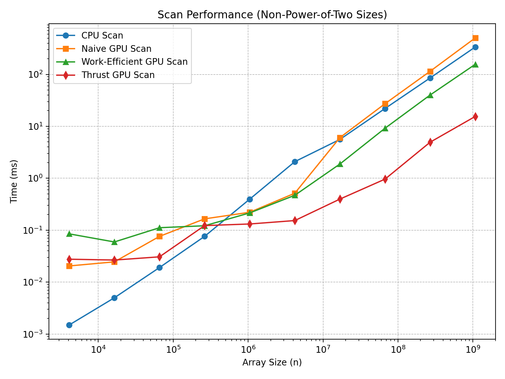

CUDA Stream Compaction
======================

**University of Pennsylvania, CIS 565: GPU Programming and Architecture, Project 2**

* Ruichi Zhang
  * [LinkedIn](https://www.linkedin.com/in/ruichi-zhang-537204381/)
* Tested on: Windows 10, AMD Ryzen 9 7950X3D @ 4201 Mhz, 16 Core(s), NVIDIA GeForce RTX 4080 SUPER

## 1. Project Description
This project implements **parallel prefix-sum (scan)** and **stream compaction** algorithms, both on the CPU and GPU.  
The following features were implemented:

- **CPU Baseline**: A sequential prefix sum for comparison.  
- **Naive GPU Scan**: simple offset-based iterative implementation.  
- **Work-Efficient GPU Scan**: uses up-sweep and down-sweep phases.  
- **Thrust Scan**: wraps the Thrust library’s `exclusive_scan`.  
- **Stream Compaction**: removes zero elements from arrays, implemented on both CPU and GPU.  

### Extra Credit Features
- **Faster Work-Efficient GPU Scan**: the number of launched threads in each loop iteration is reduced by half compared to the previous level.

## 2. Performance Analysis

### Blocksize Optimization
I experimented with different CUDA block sizes (32, 64, 128, 256, 512, 1024) for both **Naive** and **Work-Efficient** scans. All measurements are taken with `n = 2^20` . On my GPU, the average execution time for both implementations was **shortest at a block size of 128**. 
The blocksize of rest of the experiments are set to **128**.

### Analysis of the CPU, Naive, Work Efficient, and Thrust Scan

The performance of all implementations (Naive, Work-Efficient, Thrust, and CPU) on **power-of-two** array sizes (`2^n`) is shown in Figure 1. The performance of **non-power-of-two** (`2^n -3`) is similar to the situation of **power-of-two**. 

<p align="center">
  
</p>

<p align="center"><em>Figure 1. Performance comparison of CPU, Naive, Work-Efficient, and Thrust scans (Shorter time is better).</em></p>

<!-- <p align="center">
  
</p>

<p align="center"><em>Figure 1. Boids simulation with N = 5000.</em></p> -->

#### Observations
We can see that when the array size is small (< 2^20), CPU is faster, that is because of the overhead of the parellism of GPU hardware. When array size increases, GPU based approach becomes faster because of parrellism. Naive GPU scan is a little bit slower might because converting from inclusive scan to exclusive will take some time. Work efficient scan is much faster because working threads are halved at each level. Meanwhile, the thrust implementation performs best. 

#### Analysis

From the Nsight timeline, the reason that **Thrust Scan** is much faster might because it uses warp-level intrinsics and optimized memory access to minimize overhead.

The performance bottlenecks differ across implementations. **Naive Scan** is computation-bound, since it requires many redundant additions and repeated kernel launches. **Work-Efficient Scan** is memory I/O-bound: although it reduces computation to O(n), every up-sweep and down-sweep level reads and writes the full array, making global memory bandwidth the limiting factor. Finally, the **CPU Scan** is computation-bound due to its sequential execution and lack of parallelism.


### Test Output
```
****************
** SCAN TESTS **
****************
    [   4  11  31   6  36  14  32  17   9  25  30  32  24 ...  13   0 ]
==== cpu scan, power-of-two ====
   elapsed time: 11.0901ms    (std::chrono Measured)
    [   0   4  15  46  52  88 102 134 151 160 185 215 247 ... 821691696 821691709 ]
==== cpu scan, non-power-of-two ====
   elapsed time: 11.5669ms    (std::chrono Measured)
    [   0   4  15  46  52  88 102 134 151 160 185 215 247 ... 821691661 821691661 ]
    passed
==== naive scan, power-of-two ====
   elapsed time: 12.449ms    (CUDA Measured)
    passed
==== naive scan, non-power-of-two ====
   elapsed time: 12.6491ms    (CUDA Measured)
    passed
==== work-efficient scan, power-of-two ====
   elapsed time: 5.11542ms    (CUDA Measured)
    passed
==== work-efficient scan, non-power-of-two ====
   elapsed time: 4.64278ms    (CUDA Measured)
    passed
==== thrust scan, power-of-two ====
   elapsed time: 0.574464ms    (CUDA Measured)
    passed
==== thrust scan, non-power-of-two ====
   elapsed time: 0.579616ms    (CUDA Measured)
    passed

*****************************
** STREAM COMPACTION TESTS **
*****************************
    [   1   3   0   1   3   1   2   0   3   1   0   0   1 ...   0   0 ]
==== cpu compact without scan, power-of-two ====
   elapsed time: 46.0976ms    (std::chrono Measured)
    [   1   3   1   3   1   2   3   1   1   1   2   2   3 ...   2   3 ]
    passed
==== cpu compact without scan, non-power-of-two ====
   elapsed time: 45.3187ms    (std::chrono Measured)
    [   1   3   1   3   1   2   3   1   1   1   2   2   3 ...   1   2 ]
    passed
==== cpu compact with scan ====
   elapsed time: 96.6721ms    (std::chrono Measured)
    [   1   3   1   3   1   2   3   1   1   1   2   2   3 ...   2   3 ]
    passed
==== work-efficient compact, power-of-two ====
   elapsed time: 6.15424ms    (CUDA Measured)
    passed
==== work-efficient compact, non-power-of-two ====
   elapsed time: 6.63245ms    (CUDA Measured)
    passed
```

